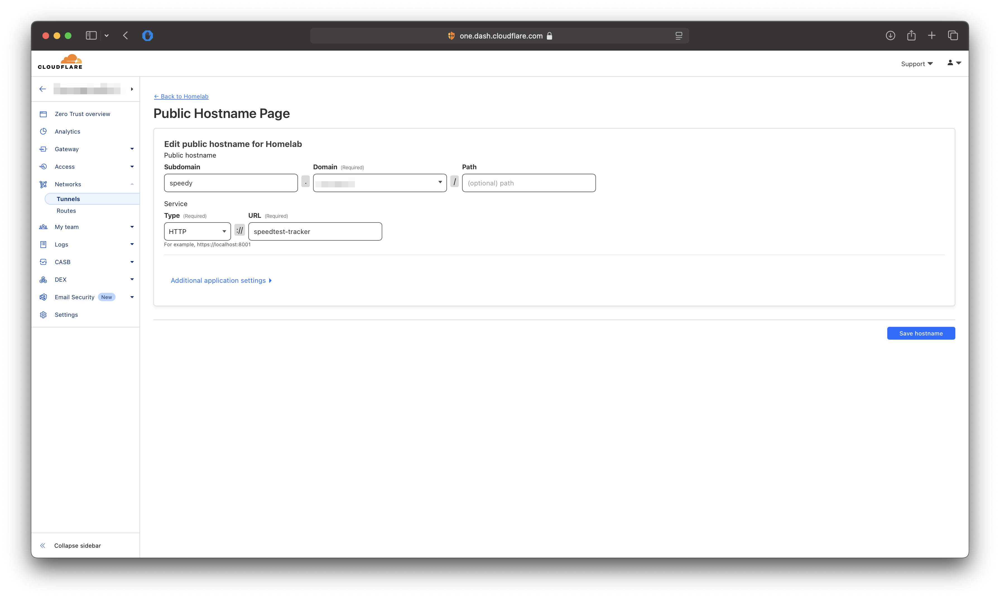

# Cloudflare Tunnel (Zero Trust)

[Cloudflare tunnel ](https://www.cloudflare.com/nl-nl/products/tunnel/)can be used as a Reverse Proxy in front of Speedtest Tracker when you want to expose the Dashboard publicly without exposing your IP Address and with a trusted certificate,You will need at add the `APP_URL` envoirment.

### Cloudflare Tunnel Configuration

* Go to the **Networks** -> **Tunnels** page.
* For the tunnel you want to add the Speedtest Tracker to. Click on **Edit**
* Go to **Public Hostname**
* Click on **Add a public hostname**
* Fill in the fields the following field
  * **Subdomain:** The subdomain you want to access the Speedtest Tracker on.
  * **Domain:** The domain you want to access the Speedtest Tracker on.
  * **Type:** Connection type to the Speedtest Tracker (http/https)
    * When choosing HTTPS you will need to disable the TLS verification under `Additional application settings -> TLS -> No TLS Verify`
  * **URL:** The URL to access the Speedtest Tracker. This can be either the IP Address:Port or the container\_name:port.


When using the container\_name Cloudflare Tunnel and Speedtest Tracker need to be on the same Docker network.


<figure><figcaption></figcaption></figure>

### Docker Configuration

Docker-Compose:

```yaml
services:
    speedtest-tracker:
        container_name: speedtest-tracker
        environment:
            - PUID=1000
            - PGID=1000
            - APP_KEY=
            - DB_CONNECTION=sqlite
            - SPEEDTEST_SCHEDULE=
            - SPEEDTEST_SERVERS=
            - PRUNE_RESULTS_OLDER_THAN=
            - CHART_DATETIME_FORMAT= 
            - DATETIME_FORMAT=
            - APP_TIMEZONE=
            - APP_URL=speedtest.yourdomain.com # Change this to your domain name
            - ASSET_URL=speedtest.yourdomain.com # Change this to your domain name
        volumes:
            - /path/to/data:/config
            - /path/to-custom-ssl-keys:/config/keys
        image: lscr.io/linuxserver/speedtest-tracker:latest
        restart: unless-stopped
```


Depending on your Cloudflare Tunnel configuration, you need to make use the Speedtest Tracker and Cloudflare Tunnel are on the same docker network.


<table><thead><tr><th width="291">Added compose part</th><th>Description</th></tr></thead><tbody><tr><td><code>APP_URL</code></td><td>URL you want to access the WebGui on.</td></tr><tr><td><code>ASSET_URL</code></td><td>URL used for loading all the needed assets. Need to be the same as the <code>APP_URL</code>.</td></tr></tbody></table>
