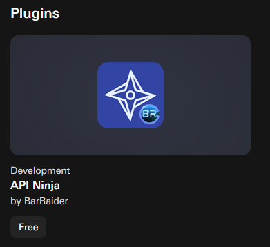

# Stream Deck


Shoutout to [MartynKeigher](https://github.com/MartynKeigher) on GitHub for [providing](https://github.com/alexjustesen/speedtest-tracker/issues/1191) these instructions.


### Required Plugin

Download the "API Ninja" plugin from the Elgato Marketplace.

<figure><figcaption></figcaption></figure>

### Configure the Buttons

1. Under the "BarRadier" plugin select "API Ninja" and drag it to an empty slot.
2. Request type should be set to `GET`.
3. API URL should be set to your application's app url and append `/api/speedtest/latest`.
4. Set the Content Type to `application/json`.
5. Set the Response Shown to `data.download` for download and `data.upload` for upload.
6. Check Parse/Format 'Response shown'.
7. Set the Format to `{0:N0}`.
8. Optionally you can add a Title Suffix: `\n(Mbps)`
9. Set the Response Type to `Text`.
10. Set Autorun every option to a refresh interval of your choice.
11. Optionally you can hide green success indicator.
12. Lastly duplicate the button and change the Response Shown to `data.download`.

<figure><figcaption></figcaption></figure>
