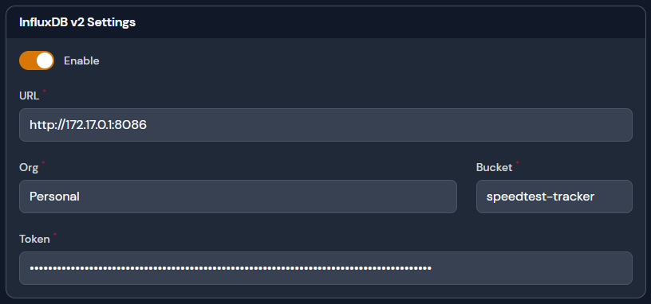

# InfluxDB2


At this time only InfluxDB2 is supported, InfluxDB(1) is planned


<figure><figcaption>
InfluxDB2 settings
</figcaption></figure>

### Settings

| Name   | Default             | Description                                                           |
| ------ | ------------------- | --------------------------------------------------------------------- |
| URL    | `blank`             | FQDM or IP address to the InfluxDB2 instance                          |
| Org    | `blank`             | Organization on which you created your bucket in                      |
| Bucket | `speedtest-tracker` | The name of the bucket you created in your org                        |
| Token  | `blank`             | API token that has access to write to the org and bucket listed above |
