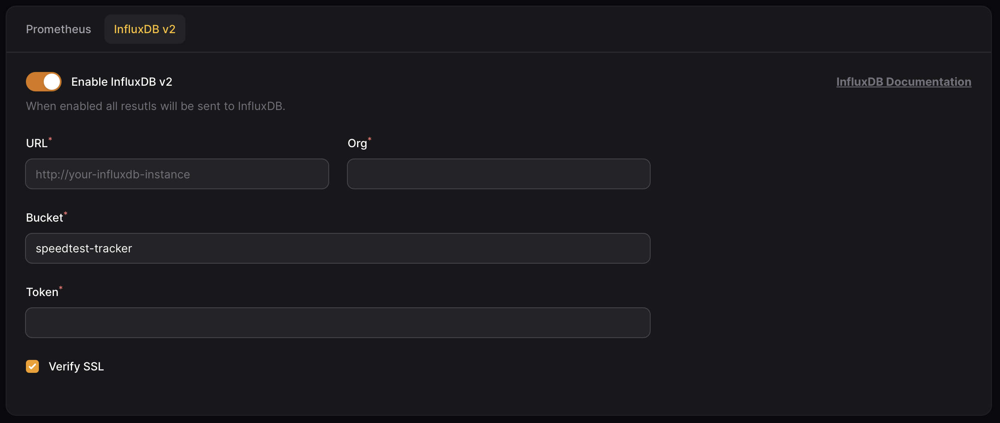

# InfluxDB v2

After every test the Speedtest Tracker can send the results to InfluxDB for long term storage or custom visualizations.&#x20;

### Settings

To configure Speedtest Tracker to send results to InfluxDB, set the following settings.

<table><thead><tr><th width="127.33333333333331">Name</th><th width="206">Default</th><th>Description</th></tr></thead><tbody><tr><td>URL</td><td><code>blank</code></td><td>FQDN or IP address to the InfluxDB2 instance</td></tr><tr><td>Org</td><td><code>blank</code></td><td>Organization on which you created your bucket in</td></tr><tr><td>Bucket</td><td><code>speedtest-tracker</code></td><td>The name of the bucket you created in your org</td></tr><tr><td>Token</td><td><code>blank</code></td><td>API token that has access to write to the org and bucket listed above</td></tr></tbody></table>

<figure><figcaption>
Influxdb v2 Settings
</figcaption></figure>

If you have a history of results, you can use the `Export current results` feature to export all data to InfluxDB.&#x20;

### Grafana Dashboard

You can use this community made Grafana Dashboard to visualize your data.



### Data pattern

The Speedtest Tracker exports data in two categories: `Tag` and `Field`. Tags are used for filtering, while fields are used for displaying the data.

<table><thead><tr><th>Name</th><th>Data Type</th><th width="100"></th></tr></thead><tbody><tr><td><code>result_id</code></td><td><code>String</code></td><td><code>Tag</code></td></tr><tr><td><code>external_ip</code></td><td><code>String</code></td><td><code>Tag</code></td></tr><tr><td><code>isp</code></td><td><code>String</code></td><td><code>Tag</code></td></tr><tr><td><code>service</code></td><td><code>String</code></td><td><code>Tag</code></td></tr><tr><td><code>server_id</code></td><td><code>String</code></td><td><code>Tag</code></td></tr><tr><td><code>server_name</code></td><td><code>String</code></td><td><code>Tag</code></td></tr><tr><td><code>server_country</code></td><td><code>String</code></td><td><code>Tag</code></td></tr><tr><td><code>server_location</code></td><td><code>String</code></td><td><code>Tag</code></td></tr><tr><td><code>healthy</code></td><td><code>String</code></td><td><code>Tag</code></td></tr><tr><td><code>status</code></td><td><code>String</code></td><td><code>Tag</code></td></tr><tr><td><code>scheduled</code></td><td><code>String</code></td><td><code>Tag</code></td></tr><tr><td><code>download</code></td><td><code>init</code></td><td><code>Field</code></td></tr><tr><td><code>upload</code></td><td><code>init</code></td><td><code>Field</code></td></tr><tr><td><code>ping</code></td><td><code>float</code></td><td><code>Field</code></td></tr><tr><td><code>download_bits</code></td><td><code>int</code></td><td><code>Field</code></td></tr><tr><td><code>upload_bits</code></td><td><code>int</code></td><td><code>Field</code></td></tr><tr><td><code>download_jitter</code></td><td><code>float</code></td><td><code>Field</code></td></tr><tr><td><code>upload_jitter</code></td><td><code>float</code></td><td><code>Field</code></td></tr><tr><td><code>ping_jitter</code></td><td><code>float</code></td><td><code>Field</code></td></tr><tr><td><code>download_latency_avg</code></td><td><code>float</code></td><td><code>Field</code></td></tr><tr><td><code>download_latency_high</code></td><td><code>float</code></td><td><code>Field</code></td></tr><tr><td><code>download_latency_low</code></td><td><code>float</code></td><td><code>Field</code></td></tr><tr><td><code>upload_latency_avg</code></td><td><code>float</code></td><td><code>Field</code></td></tr><tr><td><code>upload_latency_high</code></td><td><code>float</code></td><td><code>Field</code></td></tr><tr><td><code>upload_latency_low</code></td><td><code>float</code></td><td><code>Field</code></td></tr><tr><td><code>packet_loss</code></td><td><code>float</code></td><td><code>Field</code></td></tr></tbody></table>

