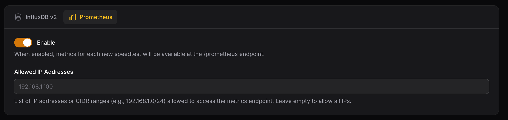

# Prometheus

After each test, Speedtest Tracker exposes the metrics for Prometheus to scrape. For long term storage or custom visualizations.

### Authentication

To configure Speedtest Tracker to expose its metrics behind `basic auth`, apply the following settings

<table><thead><tr><th width="127.33333333333331">Name</th><th width="206">Default</th><th>Description</th></tr></thead><tbody><tr><td>Use Basic Authentication</td><td>false</td><td>Enable / Disable <code>Basic Auth</code></td></tr><tr><td>username</td><td><code>blank</code></td><td>username for authentication </td></tr><tr><td>password</td><td><code>blank</code></td><td>password for authentication</td></tr></tbody></table>

<figure><figcaption></figcaption></figure>

### Data pattern

Speedtest Tracker exports data in two categories: labels and metrics. Labels are used for filtering, while metrics are used for displaying data.

<table><thead><tr><th>Name</th><th width="100"></th></tr></thead><tbody><tr><td><code>app_name</code></td><td><code>label</code></td></tr><tr><td><code>isp</code></td><td><code>label</code></td></tr><tr><td><code>server_id</code></td><td><code>label</code></td></tr><tr><td><code>server_name</code></td><td><code>label</code></td></tr><tr><td><code>server_country</code></td><td><code>label</code></td></tr><tr><td><code>server_location</code></td><td><code>label</code></td></tr><tr><td><code>healthy</code></td><td><code>label</code></td></tr><tr><td><code>status</code></td><td><code>label</code></td></tr><tr><td><code>scheduled</code></td><td><code>label</code></td></tr><tr><td><code>download_bytes</code></td><td><code>Metric</code></td></tr><tr><td><code>upload_bytes</code></td><td><code>Metric</code></td></tr><tr><td><code>ping</code></td><td><code>Metric</code></td></tr><tr><td><code>download_bits</code></td><td><code>Metric</code></td></tr><tr><td><code>upload_bits</code></td><td><code>Metric</code></td></tr><tr><td><code>download_jitter</code></td><td><code>Metric</code></td></tr><tr><td><code>upload_jitter</code></td><td><code>Metric</code></td></tr><tr><td><code>ping_jitter</code></td><td><code>Metric</code></td></tr><tr><td><code>download_latency_avg</code></td><td><code>Metric</code></td></tr><tr><td><code>download_latency_high</code></td><td><code>Metric</code></td></tr><tr><td><code>download_latency_low</code></td><td><code>Metric</code></td></tr><tr><td><code>upload_latency_avg</code></td><td><code>Metric</code></td></tr><tr><td><code>upload_latency_high</code></td><td><code>Metric</code></td></tr><tr><td><code>upload_latency_low</code></td><td><code>Metric</code></td></tr><tr><td><code>packet_loss</code></td><td><code>Metric</code></td></tr></tbody></table>

### Prometheus Scrape Config

Below is an example Prometheus scrape configuration:

```yaml
scrape_configs:
  - job_name: 'speedtest-tracker'
    scrape_interval: 60s # Adjust to your set schedule
    scrape_timeout: 10s
    metrics_path: /prometheus
    static_configs:
      - targets: ['speedtest-tracker.local']
```
