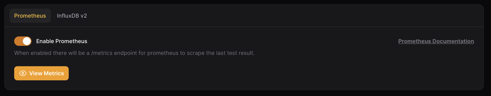

# Prometheus

After every test the Speedtest Tracker can expose the results for Prometheus to scrape for long term storage or custom visualizations.

### Settings

To have the test metrcis exposed all you need to do is enbable Prometheus in the settings.

<figure><figcaption><p>Prometheus Settings</p></figcaption></figure>

### Prometheus Configuration&#x20;

In order for Prometheus to scrape the metric you will need to add the following configuration to your `prometheus.yml`.

```
- job_name: 'speedtest-tracker'
  scrape_interval: 1h
  static_configs:
    - targets: ['speedtest-tracker.dev']
```


Adjust the `scrape_interval` & `Targets` accordingly.


### Data Pattern

The Speedtest Tracker exports data in two categories: `labels` and `metrics`. Labels are used for filtering, while metrics are used for displaying the data.

<table><thead><tr><th width="333">Name</th><th></th></tr></thead><tbody><tr><td><code>isp</code></td><td><code>Label</code></td></tr><tr><td><code>service</code></td><td><code>Label</code></td></tr><tr><td><code>server_id</code></td><td><code>Label</code></td></tr><tr><td><code>server_name</code></td><td><code>Label</code></td></tr><tr><td><code>server_country</code></td><td><code>Label</code></td></tr><tr><td><code>server_location</code></td><td><code>Label</code></td></tr><tr><td><code>externalIp</code></td><td><code>Label</code></td></tr><tr><td><code>healthy</code></td><td><code>Label</code></td></tr><tr><td><code>status</code></td><td><code>Label</code></td></tr><tr><td><code>scheduled</code></td><td><code>Label</code></td></tr><tr><td><code>result_id</code></td><td><code>Metric</code></td></tr><tr><td><code>download</code></td><td><code>Metric</code></td></tr><tr><td><code>upload</code></td><td><code>Metric</code></td></tr><tr><td><code>ping</code></td><td><code>Metric</code></td></tr><tr><td><code>download_bits</code></td><td><code>Metric</code></td></tr><tr><td><code>upload_bits</code></td><td><code>Metric</code></td></tr><tr><td><code>download_jitter</code></td><td><code>Metric</code></td></tr><tr><td><code>upload_jitter</code></td><td><code>Metric</code></td></tr><tr><td><code>ping_jitter</code></td><td><code>Metric</code></td></tr><tr><td><code>download_latency_avg</code></td><td><code>Metric</code></td></tr><tr><td><code>download_latency_high</code></td><td><code>Metric</code></td></tr><tr><td><code>download_latency_low</code></td><td><code>Metric</code></td></tr><tr><td><code>upload_latency_avg</code></td><td><code>Metric</code></td></tr><tr><td><code>upload_latency_high</code></td><td><code>Metric</code></td></tr><tr><td><code>upload_latency_low</code></td><td><code>Metric</code></td></tr><tr><td><code>packet_loss</code></td><td><code>Metric</code></td></tr></tbody></table>
