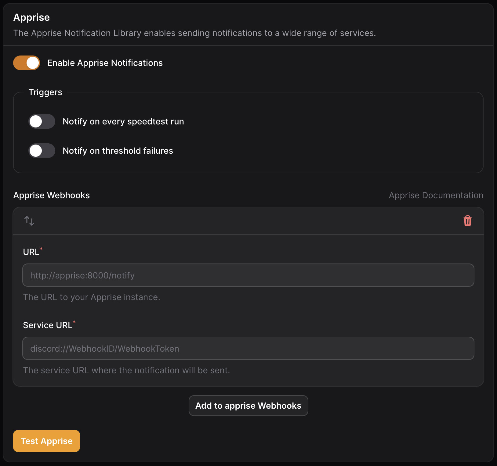

# Apprise

Apprise provides a unified notification channel that lets you send alerts to numerous services—like Discord, Pushover, and Ntfy as well as many additional platforms

<figure><figcaption>
Apprise  settings
</figcaption></figure>

### Sidecar Container

To use Apprise, you’ll need to set up your own sidecar container. This container isn’t created automatically, so make sure to include it in your deployment. See the Apprise [Github Repo](https://github.com/caronc/apprise-api) for the setup instructions.

#### Environment Variable&#x20;

&#x20;To connect Speedtest Tracker with your Apprise sidecar container, define the `APPRISE_URL` environment variable with the container’s URL (e.g., `http://192.168.1.5:8000`)

### Apprise Channels

Apprise channels are the formatted URLs used by Apprise to send notifications to various services. Refer to the [Apprise documentation](https://github.com/caronc/apprise?tab=readme-ov-file#supported-notifications) for a full list of supported channels and their required formats.

### Triggers

<table><thead><tr><th width="237">Name</th><th>Description</th></tr></thead><tbody><tr><td>On completed speedtest</td><td>On each successful speedtest a notification will be send to the application.</td></tr><tr><td>On absolute threshold failure</td><td>On any absolute threshold failure a notification will be send to the application.</td></tr></tbody></table>
