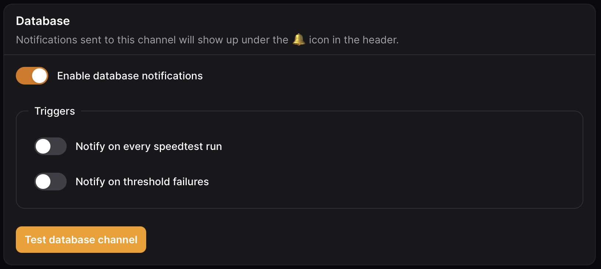

# Database

Notifications sent to the database channel will show up under the 🔔 icon in the header of the application.

<figure><figcaption>
Database settings
</figcaption></figure>

### Triggers

<table><thead><tr><th width="237">Name</th><th>Description</th></tr></thead><tbody><tr><td>on every scheduled speedtest run</td><td>On each successful scheduled speedtest a notification will be send to the application.</td></tr><tr><td>on threshold failures for scheduled speedtests</td><td>On any absolute threshold failure for scheduled speedtest  a notification will be send to the application.</td></tr></tbody></table>
