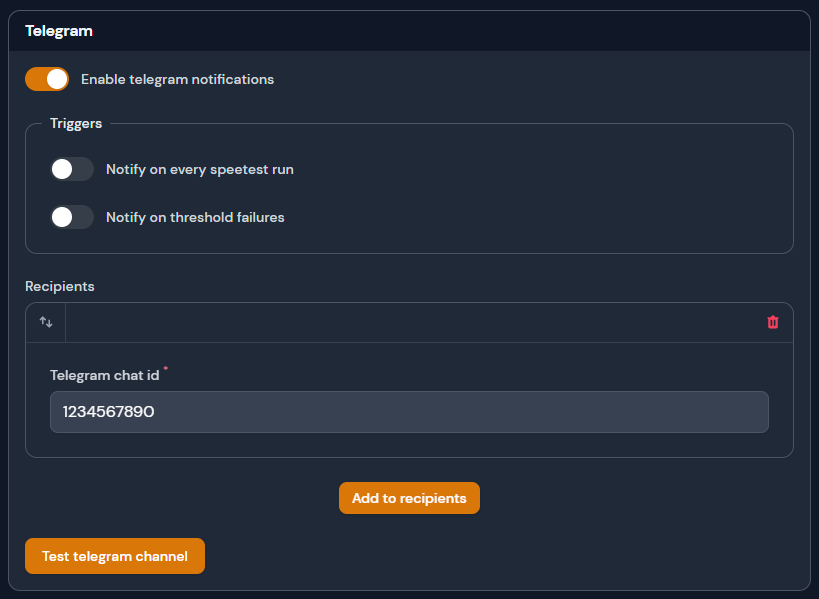

# Telegram

Notifications sent to the Telegram channel will be sent to the list of recipients.

<figure><figcaption>
Telegram settings
</figcaption></figure>

### Setting Up Telegram

To configure Telegram for notifications you'll need to have a [Telegram](https://telegram.org/) account and follow the directions below.

1. Create a Telegram bot by starting a message with `@BotFather`.
2. Using the bot's token ID to add the following variable in your `.env` file in your mounted data directory. `TELEGRAM_BOT_TOKEN=putyourtokenhere`
3. Next you'll need your own chat ID, start a chat with `@Get_Id_Bot` and add that to your "Recipients" list and click "Save".
4. Start a chat with your bot your created in step 1 to start receiving notification from yout Telegram bot.

### Triggers

| Name                          | Description                                                                       |
| ----------------------------- | --------------------------------------------------------------------------------- |
| On completed speedtest        | On each successful speedtest a notification will be send to the application.      |
| On absolute threshold failure | On any absolute threshold failure a notification will be send to the application. |

### Recipients

A recipient is any valid Telegram chat ID, you can add one or many recipients that will receive notifications based on the triggers selected.
