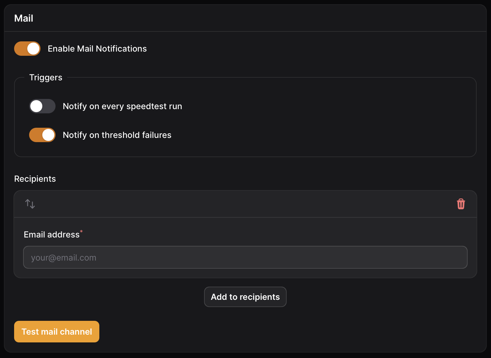

# Mail

Notifications sent to the mail channel will be emailed to the list of recipients.

<figure><figcaption><p>Mail settings</p></figcaption></figure>

### Setting Up SMTP

Speedtest Tracker uses SMTP mail protocol to send email messages, you can use any service that allows you to send emails via SMTP.&#x20;

To configure the mail server settings you'll need to update the following variables in your `.env` file or add them to the environment variables passed into the container.


Make sure these are not set in both your `.env` file or your `docker-compose.yml` file as that can cause issues.


```
MAIL_MAILER=smtp
MAIL_HOST=mailhog
MAIL_PORT=1025
MAIL_USERNAME=null
MAIL_PASSWORD=null
MAIL_ENCRYPTION=null
MAIL_FROM_ADDRESS="hello@example.com"
MAIL_FROM_NAME="Speedtest Tracker"
```

### Triggers

<table><thead><tr><th width="237">Name</th><th>Description</th></tr></thead><tbody><tr><td>On completed speedtest</td><td>On each successful speedtest a notification will be send to the application.</td></tr><tr><td>On absolute threshold failure</td><td>On any absolute threshold failure a notification will be send to the application.</td></tr></tbody></table>

### Recipients

A recipient is any valid email address, you can add one or many recipients that will receive notifications based on the triggers selected.
