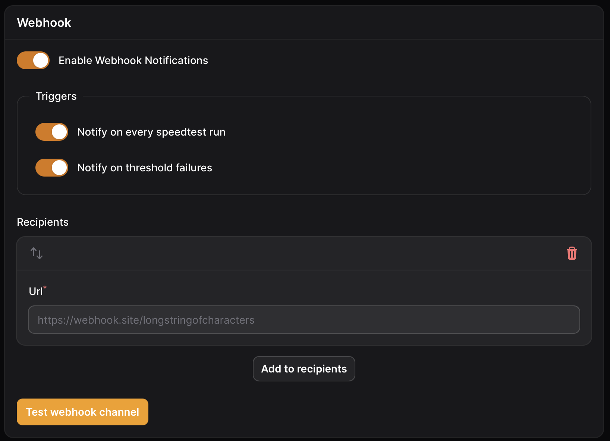

# Webhook

A webhook will send a JSON payload to a receiver of your choice

<figure><figcaption><p>Webhook settings</p></figcaption></figure>

### Payload

Payload sent for a completed test

```json
{
  "result_id": 1,
  "site_name": "Speedtest Tracker",
  "server_name": "Speedtest",
  "server_id": 52365,
  "isp": "Super Speed",
  "ping": 2.782,
  "download": 937874216,
  "upload": 937797864,
  "packet_loss": 0,
  "speedtest_url": "https://www.speedtest.net/result/c/af8ddebf-7ef7-4b8d-b0c1-aaaaaaaaaaaa",
  "url": "http://localhost/admin/results"
}
```

Payload sent for a threshold failure

```json
{
  "result_id": 1,
  "site_name": "Speedtest Tracker",
  "isp": "Super Speed",
  "benchmarks": {
    "download": {
      "bar": "min",
      "passed": false,
      "type": "absolute",
      "value": 2000,
      "unit": "mbps"
    },
    "upload": {
      "bar": "min",
      "passed": false,
      "type": "absolute",
      "value": 2000,
      "unit": "mbps"
    },
    "ping": {
      "bar": "max",
      "passed": false,
      "type": "absolute",
      "value": 1,
      "unit": "ms"
    }
  },
  "speedtest_url": "https://www.speedtest.net/result/c/af8ddebf-7ef7-4b8d-b0c1-aaaaaaaaa",
  "url": "http://localhost/admin/results"
}
```

### Triggers

<table><thead><tr><th width="237">Name</th><th>Description</th></tr></thead><tbody><tr><td>On completed speedtest</td><td>On each successful speedtest a notification will be send to the application.</td></tr><tr><td>On absolute threshold failure</td><td>On any absolute threshold failure a notification will be send to the application.</td></tr></tbody></table>
